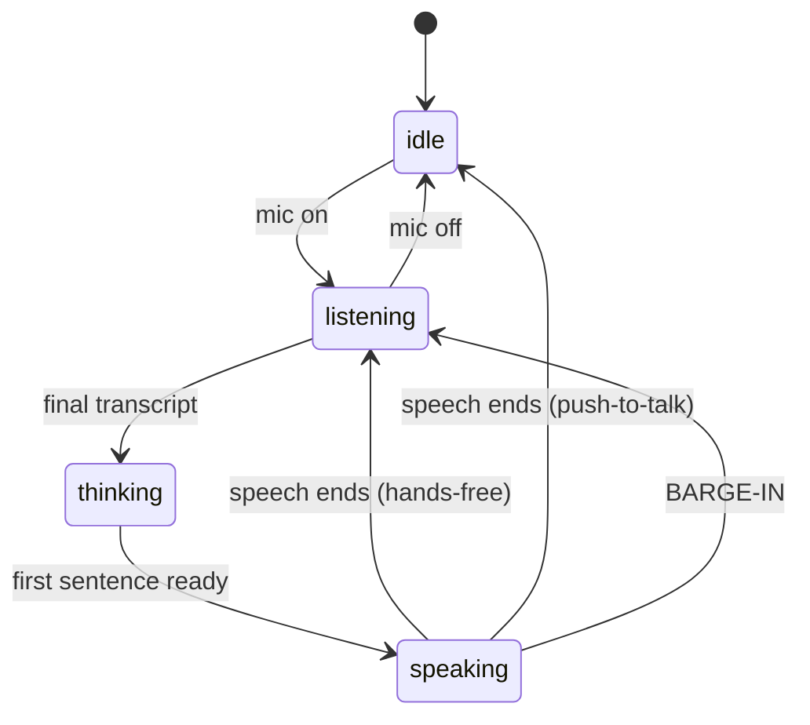

# Echo — a realtime GenAI voice agent

> **Talk to an AI and it talks back — in real time, interruptible, with tools.**
> Say *"what's the weather in Paris and the time in Tokyo?"* out loud and hear the
> answer streaming back while you cut Echo off mid-sentence to change the subject.

Echo is a browser-based **realtime conversational voice AI** agent: full-duplex
speech in, streamed speech out, function-calling tools in the middle, and a
turn-taking state machine that decides whose turn it is. It's a portfolio project
about the part of voice AI that *isn't* the model — the **~800 milliseconds** of
perceived latency and the **barge-in turn-taking** that separate something that
feels *alive* from a 1970s answering machine.

**Keywords for the curious / the crawler:** generative AI, voice agent,
speech-to-text (STT), text-to-speech (TTS), LLM streaming, Server-Sent Events,
function calling / tool use, barge-in, turn-taking, low-latency voice, Web Speech
API, Google Gemini.

> **🔗 Live demo:** _TODO — deploy URL goes here._ (Until then, run it locally in
> ~30 seconds; see [Run it locally](#run-it-locally). No API key required.)

The thesis, in one line: **the model was the easy part; the 800 milliseconds were
the hard part.** The long version is in the blog posts below.

---

## What it does

- 🎙️ **Real-time voice** — speak naturally, hear a reply in about a second.
- 🧠 **Streams + tools** — Gemini answers token-by-token and can call **weather**,
  **time-zone**, and **web-search** tools mid-conversation.
- 🔊 **Speaks as it thinks** — a sentence chunker starts text-to-speech on the
  *first* sentence instead of waiting for the whole reply. This is the single
  biggest perceived-latency win.
- ↩️ **Hands-free + barge-in (default)** — Echo listens continuously and you can
  talk over it to cut it off. Headphones recommended (see
  [What's hard about this](#whats-hard-about-this-the-honest-part)); push-to-talk
  is a one-click alternative mode.
- ⌨️ **First-class text fallback** — no mic, locked-down machine, Firefox or iOS?
  The typed demo always works. Voice is an enhancement over a working text core.
- 🎭 **6 personas** — Witty Mentor, Noir Detective, Hype Coach, Calm Guide,
  Storyteller, and more. Each swaps the system prompt, auto-picks a matching
  browser voice, and shows its own starter prompts.
- 🗣️ **Wake word (optional, on-device)** — say *"Computer"* to start a turn
  hands-free, detected locally with Picovoice Porcupine. Off by default; opt-in
  via env key.
- 🔀 **Two voice engines, one toggle** — **Classic** (the default, hand-built
  pipeline above) or **Live**: Gemini's native Live API. Live connects the
  browser *directly* to Gemini over a WebSocket for native PCM speech-to-speech
  with server-side VAD and barge-in. See
  [Classic vs. Live](#classic-vs-live-two-voice-engines).
- 🔬 **"Under the hood" dev panel** — a CPU-chip toggle opens a live **latency
  waterfall** (STT → model first-token → per-sentence TTS → turn-total), plus
  tokens, tool calls, and the turn-state timeline. The 800ms budget made
  literal — and it runs for *both* engines.
- 🎚️ **Model picker** — swap the text/tool model from Settings. The shared demo
  key runs `gemini-3.1-flash-lite`; 2.5 / 3 / 3.5 Flash variants unlock with
  your own key.

## Why it's interesting

Most "AI voice" demos are one-shot dictation or text chat with a speaker bolted
on. Echo closes the **whole spoken loop** — mic → transcribe → think → speak — and
lets a human *interrupt* it, which is the thing that actually makes a conversation
feel human. Everything hard about voice AI lives in that loop: the latency budget,
the turn-taking, and the physical fact that a laptop mic can hear the laptop
speaker. None of it is the LLM. That's the whole point of the project.

## Architecture overview

Echo ships **two voice engines** behind a Classic | Live toggle. **Classic** (the
default) is the hand-built pipeline below: voice runs **entirely in the browser**
and the only server round-trip is the model's text, streamed back over **SSE** — so
the transport is one-directional and simple, an honest contrast to the WebSockets I
used in my [gemini-chat-app](../gemini-chat-app). **Live** is Gemini's native Live
API and inverts that (see [Classic vs. Live](#classic-vs-live-two-voice-engines)).

### The pipeline (STT → SSE → chunker → TTS) — Classic engine

```mermaid
flowchart LR
    A[🎙️ You speak] -->|Web Speech API STT<br/>browser-side| B[Transcript]
    B -->|POST /api/chat| C[Next.js route]
    C -->|@google/genai stream<br/>+ function calling| D[Gemini]
    D -->|SSE tokens| E[SentenceChunker]
    E -->|first complete sentence| F[TTS queue]
    F -->|speechSynthesis<br/>browser-side| G[🔊 Echo speaks]
    G -.->|user talks over it = barge-in| A
    style C fill:#0e7490,color:#fff
    style G fill:#be123c,color:#fff
```

- **STT & TTS run in the browser** via the Web Speech API — free, no key, and the
  speech never leaves your machine. They live behind hooks
  (`useSpeechRecognition`, `useSpeech`) so a cloud STT/TTS can drop in later.
- **The server only streams the model.** `src/app/api/chat/route.ts` proxies
  Gemini and runs the function-calling loop; there is no audio infrastructure.
- **Speak-as-you-stream** is the key trick: `SentenceChunker` flushes the first
  complete sentence to TTS the instant it appears, so Echo starts talking on
  sentence one while sentence three is still generating.

### Turn-taking as an explicit state machine

Turn-taking is a pure reducer (`src/lib/conversation/turnMachine.ts`), not a pile
of booleans. Out-of-order async callbacks — and voice has *many* — become no-ops
instead of bugs.



The orchestrator (`src/hooks/useVoiceAgent.ts`) dispatches events into this
machine and never asks "wait, what were we doing?"

### Classic vs. Live (two voice engines)

The Classic | Live toggle swaps the entire voice backend underneath the same UI.
They're deliberately opposite in shape, and that's the point of having both:

| | **Classic** (default) | **Live** |
|---|---|---|
| STT / TTS | Browser Web Speech API | Native, inside the model |
| Transport | SSE (text only) | WebSocket, browser ↔ Gemini **directly** |
| Audio | none server-side | PCM in 16 kHz / out 24 kHz |
| Turn-taking | Echo's state machine + chunker | Server-side VAD + barge-in signal |
| Cost | free (STT/TTS in browser) | audio billed **as tokens** |

Live (`src/hooks/useLiveSession.ts`, `src/lib/live.ts`) never gets the raw API
key: the server mints a **single-use ephemeral token** (`/api/live-token`,
`ai.authTokens.create`) scoped to the Live model + AUDIO modality, and the browser
passes that token to `ai.live.connect`. Switching to Live does **not** open a
socket — you click **Connect** explicitly, so the shared quota is never spent on a
page load. Live runs on the demo key only for now (BYOK-for-Live is a later
concern), and because audio-token pricing is unconfirmed, the dev panel reports
Live in **tokens, not dollars**. The why-this-way reflection is in
[the lessons post](docs/blog/lessons-and-the-near-future-of-voice.md).

## Tools

Echo's tools are plain function declarations dispatched in the chat route
(`src/lib/conversation/tools.ts`):

| Tool | What it does | Key needed? |
|---|---|---|
| `get_current_time` | Current time for a given time zone | No |
| `get_weather` | Current weather via **Open-Meteo** | No (keyless API) |
| `web_search` | Quick web lookup via Google Programmable Search | Optional — degrades to model knowledge without a key |

## Tech stack

**TypeScript · Next.js 16 (App Router) · React 19 · Tailwind v4 · `@google/genai`
(Gemini `gemini-3.1-flash-lite` text/tools + `gemini-3.1-flash-live-preview` for
the Live engine) · Web Speech API · Server-Sent Events · WebSocket (Live).**

> **SDK note:** Echo uses the current **`@google/genai`** SDK, not the legacy
> `@google/generative-ai` used by the older gemini-chat-app — cleaner streaming and
> function calling. One Gemini 3 wrinkle: when you send a `functionCall` back for
> the tool-result round, you must preserve its `thoughtSignature` part verbatim or
> the API rejects it (400). Echo collects the model's parts straight from the
> stream to keep that intact.

## Run it locally

```bash
npm install
cp .env.example .env.local   # then add a key, or leave empty to use BYOK in-app
npm run dev                  # http://localhost:3200
```

Open <http://localhost:3200> in **Chrome or Edge on desktop**, and **wear
headphones** for the cleanest hands-free experience (see below for why). The first
run shows a 3-step intro: About → How to talk to it → Enable mic. No mic? The
typed input works everywhere.

### Environment

| Var | Purpose |
|---|---|
| `GEMINI_API_KEY` | Server demo-key fallback (optional; BYOK preferred). |
| `ECHO_MODEL` | Default text/tool model id (the in-app model picker can override per session; BYOK models are server-validated). Defaults to `gemini-3.1-flash-lite`. |
| `GOOGLE_SEARCH_API_KEY` / `GOOGLE_SEARCH_ENGINE_ID` | Optional — enables the `web_search` tool. Without them, Echo answers from its own knowledge. |
| `NEXT_PUBLIC_PICOVOICE_ACCESS_KEY` | Optional — enables the on-device wake-word toggle. Free key from [Picovoice Console](https://console.picovoice.ai/). Absent → toggle is disabled with a hint. |
| `NEXT_PUBLIC_APP_URL`, `PORT` | App URL / port (3200). |

### Wake word (optional, on-device)

With `NEXT_PUBLIC_PICOVOICE_ACCESS_KEY` set, a **Wake word** toggle appears.
[Picovoice Porcupine](https://picovoice.ai/) then listens **on-device** (WASM, in
the browser) for the built-in keyword **"Computer"** and starts a listening turn
on detection. The modules are lazy-loaded only when the toggle is on, so they
never affect the build otherwise. The ~1MB acoustic model
(`public/models/porcupine_params.pv`) is **gitignored** — fetch it only if you
enable the feature:

```bash
mkdir -p public/models
curl -L -o public/models/porcupine_params.pv \
  https://raw.githubusercontent.com/Picovoice/porcupine/master/lib/common/porcupine_params.pv
```

Caveats (also shown in the UI): the tab must stay open (a web app has no OS-level
background listening), Chrome/Edge + mic permission required.

## Demo key + BYOK

Like the rest of the portfolio: instant use on a shared demo key with a usage
meter, plus a **"bring your own free Gemini key"** expander for unlimited use.
STT/TTS need no key at all, which makes the zero-setup demo even smoother.

The shared demo key is **hard-capped at 250 model calls per rolling 24h** (a single
chat turn can fire several calls when it uses tools, and every actual call counts —
even ones that error). **BYOK requests bypass the cap entirely**, and the key is
stored only in your browser's `localStorage`, never sent anywhere but Echo's own
API. The counter is **in-memory / per-process** (it resets on a Render free-tier
cold start) — a best-effort soft guard, not a durable global ceiling. A durable
cross-process cap would live in an external KV like Upstash Redis; intentionally
not added here.

## What's hard about this (the honest part)

Voice AI is a latency-and-physics problem wearing an AI costume. The hard parts:

- **The 800ms latency budget.** A human conversational turn gap is ~200ms, and a
  voice agent starts feeling broken past ~800ms–1.5s. The naive "wait for the full
  reply, then speak" approach burns 3–4 seconds of dead air per turn. Echo's fix is
  structural — overlap the stages with the sentence chunker — not "buy a faster
  model." The deep dive: [The 800ms Problem](docs/blog/the-800ms-problem.md).
- **The mic hears Echo's own TTS.** While `speechSynthesis` plays through the
  speakers, the mic can transcribe Echo talking to itself and fire a false
  interrupt — an echo loop, literally. The Web Speech API doesn't expose the raw
  mic stream, so you *cannot* apply echo cancellation. Echo mitigates this by
  **pausing the recognizer while it speaks**, adding a **post-TTS cooldown**, and
  requiring a **minimum interim length** before honoring barge-in. **Headphones are
  recommended**; genuine interruption (talking over Echo as the queue drains, or
  tapping the mic) still works, and **push-to-talk is the alternative mode**.
- **Browser support is narrow.** The Web Speech API is **Chrome/Edge-only** and
  effectively unsupported on iOS Safari. That's why the typed input is first-class,
  not a courtesy — a reviewer on Firefox or an iPhone still gets a working demo.
- **Local TTS voices are robotic.** Echo auto-selects the best available local
  voice (it scores `speechSynthesis` voices, preferring neural/online ones); a
  higher-quality cloud TTS is the planned upgrade, and the seam is already in
  `useSpeech`.

## Blog posts

Three write-ups, close-up to wide-angle:

1. **[The 800ms Problem](docs/blog/the-800ms-problem.md)** — the latency build-log:
   the pipeline, speak-as-you-stream, the state machine, barge-in, and the echo
   loop.
2. **[The model was the easy part](docs/blog/lessons-and-the-near-future-of-voice.md)**
   — a reflection on the lessons and the tech-choice trade-offs, including why I
   built the pipeline by hand *and then* added the managed Live API beside it, and
   what the latency waterfall taught me about observability.
3. **[The state of voice AI](docs/blog/the-state-of-voice-ai.md)** — the wide-angle
   market analysis: the shift to native speech-to-speech, latency as the product,
   cloud vs. on-device, who's building it (OpenAI Realtime, Gemini Live,
   ElevenLabs), and an engineer's take, grounded in 2025–2026 sources.

## Deploying (Render free tier)

- **Build:** `npm install && npm run build`
- **Start:** `npm run start` (binds to `PORT`, defaults to 3200)
- Set `GEMINI_API_KEY` in the Render dashboard (never commit it).
- Free instances spin down when idle and cold-start in ~30s — fine for a portfolio
  demo. Transcripts are intentionally ephemeral.
- Because STT/TTS are browser-side, there's no audio infrastructure to provision;
  the server only proxies the model stream.

## Running alongside the other portfolio apps

Ports are deconflicted by design:

| App | Port |
|---|---|
| net-trailers | 3000 |
| gemini-chat-app | 5000 |
| scout (Scout) | 3100 |
| **echo (Echo)** | **3200** |

---

A portfolio project by Nathan Watkins ·
[GitHub](https://github.com/n8watkins) ·
[Portfolio](https://n8sportfolio.vercel.app/)
