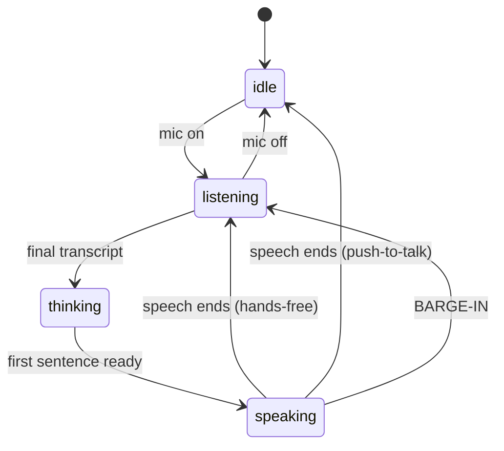

# The 800ms Problem

> *I got Gemini talking out loud in an afternoon. Making it not feel like a 1970s
> answering machine took two weeks.*

I've built a chat app that streams tokens over WebSockets. I've built voice
*search* that uses the browser's Web Speech API for one-shot dictation. Echo is
the project where I finally tried to close the whole loop — **mic → transcribe →
think → speak** — and let a human interrupt it. That's where I learned that for a
voice agent, **the model wasn't the hard part. The milliseconds were.**

## The pipeline (and where the time hides)

A spoken turn has three hops, and every one costs you:


The naive version waits for the *whole* reply before it speaks. Add it up: a
moment of silence after you stop talking, then a beat for the first token, then
a few seconds while the model finishes, *then* the voice starts. Three or four
seconds of dead air. Every single turn. It feels broken even though every
component is "working."

> The user doesn't experience your architecture. They experience the **gap before
> the voice starts.**

## The fix that mattered most: speak as you stream

Here's the trick that turned a 3-second wait into something closer to **800ms**:
don't wait for the full reply. **Chunk the token stream into sentences and start
text-to-speech on sentence one.**

The model is already streaming tokens. So I buffer them and flush a *speakable*
chunk the moment I hit sentence-ending punctuation:

```ts
// lib/conversation/sentenceChunker.ts (the gist)
push(token: string): string[] {
  this.buffer += token;
  const sentences = [];
  // emit every complete sentence: . ! ? or newline
  while (boundary.test(this.buffer)) {
    sentences.push(clean(takeFirstSentence(this.buffer)));
  }
  return sentences; // hand each to the TTS queue immediately
}
```

By the time the model is on sentence three, Echo is already *saying* sentence
one. The perceived latency collapses to "how long until the first sentence is
done" — which is short, because sentences are short.

A couple of things I learned the hard way:

- **Strip markdown and emoji first.** A synthesizer will happily read
  "asterisk asterisk bold asterisk asterisk" out loud. The chunker cleans
  `**`, backticks, list bullets, and emoji before anything is spoken. I also
  prompt the model to talk like a person — short sentences, no headings, "degrees
  Fahrenheit" not "°F".
- **Tool calls pause the stream, and that's fine.** When Gemini calls a tool, the
  token stream just *stops*, the tool runs, and a second model call continues. The
  chunker has to tolerate that gap without blurting half a sentence. The fix is
  almost anticlimactic: it only ever flushes *complete* sentences, so a
  half-buffered clause simply waits across the pause. (Getting the SDK to *accept*
  the tool round at all was the real fight — Gemini 3 rejects a `functionCall`
  sent back without its `thoughtSignature`. Solution: keep the model's parts
  verbatim from the stream instead of reconstructing them.)

## Turn-taking is a state machine, not a pile of booleans

My first version had `isListening`, `isThinking`, `isSpeaking`, `micOn`… and they
*lied to each other* constantly. TTS would fire while still listening; a stale
"thinking" flag would swallow the next turn. The walkie-talkie problem: nobody
agreed whose turn it was.

So I made the turns explicit:



One pure reducer, `transition(state, event)`. Out-of-order async callbacks — and
in voice there are *many* — become no-ops instead of bugs. The orchestrator hook
just dispatches events; it never asks "wait, what were we doing?"

## Barge-in: letting a human interrupt

The thing that makes a conversation feel alive is being able to *cut in*. When
the user starts talking while Echo is speaking, I want to immediately
`speechSynthesis.cancel()`, drop the rest of the queued sentences, abort the
in-flight model stream, and jump back to listening with the new input.

Detecting it is one line — the recognizer fires an interim result while state ===
`speaking`. The cleanup is the careful part: cancel TTS, reset the chunker, abort
the fetch, then dispatch `BARGE_IN`. Miss any one and you get ghost audio.

And here's the honest catch that reshaped the whole project:

> While the speakers are playing Echo's voice, **the microphone hears it** and the
> recognizer transcribes Echo talking to itself. Instant false interrupt. An echo
> loop, literally.

The Web Speech API doesn't hand you the raw mic stream, so you can't run echo
cancellation against your own output. The fix that kept hands-free as the default
without the loop is layered:

1. **Pause the recognizer while Echo speaks.** The moment the first sentence goes
   to TTS I `abort()` the continuous recognizer, so for most of Echo's turn the
   mic literally isn't listening and can't transcribe Echo's own voice.
2. **A post-TTS cooldown.** When the speech queue drains I wait a few hundred
   milliseconds before resuming and before honoring barge-in again — long enough
   for any trailing speaker audio to die out.
3. **A minimum interim length.** A stray syllable that slips through the cracks
   isn't treated as an interrupt; a genuine interruption is a longer interim.

So **hands-free + barge-in is the default**, headphones recommended for the
cleanest run, and **push-to-talk is the alternative** mode a click away. I'd
rather ship the live-feeling mode and be honest about its one hardware caveat
than hide it behind a toggle.

## Why browser Web Speech API (and where it bites)

It's free, keyless, and instant — perfect for a zero-setup demo. The speech never
even leaves your browser. But:

- It's **Chrome/Edge-flavored.** iOS Safari is effectively a no-show and gates
  audio behind a user gesture.
- Accents and noisy rooms are hit-or-miss.
- You get **no server-side control** over the recognizer.

Which is why the **typed input is first-class**, onboarding recommends Chrome up
front, and both STT and TTS live behind hooks (`useSpeechRecognition`,
`useSpeech`). The seam is deliberate: swapping in cloud STT or higher-quality
neural **cloud TTS** later is a hook change, not a rewrite. (Local voices are
robotic; that's the obvious next upgrade.)

## Why SSE this time, not WebSockets

Last project I reached for WebSockets. This time the data only flows one way —
server streams model tokens to the client; STT and TTS happen *in the browser*.
A full-duplex socket would be a heavier tool than the job needs. Server-Sent
Events are a `ReadableStream` and a `text/event-stream` header. Knowing when
*not* to use the fancier tool is its own skill.

## What it taught me about AI UX

The model is a commodity now. What's left — the part you actually feel — is the
**latency and the turn-taking.** Latency *is* the product. There's an uncanny line
between "responsive" and "alive," and it's drawn in milliseconds: the gap before
the voice starts, whether you can cut it off, whether it knows whose turn it is.

I spent an afternoon making Gemini talk. I spent two weeks on the 800 milliseconds
that decide whether you'd ever want it to.

---

*More reading: the reflection in [The model was the easy part](./lessons-and-the-near-future-of-voice.md),
and the wider market take in [The state of voice AI](./the-state-of-voice-ai.md).*

*Echo is open source — read the [turn-taking state machine](../../src/lib/conversation/turnMachine.ts)
and the [sentence chunker](../../src/lib/conversation/sentenceChunker.ts).*
