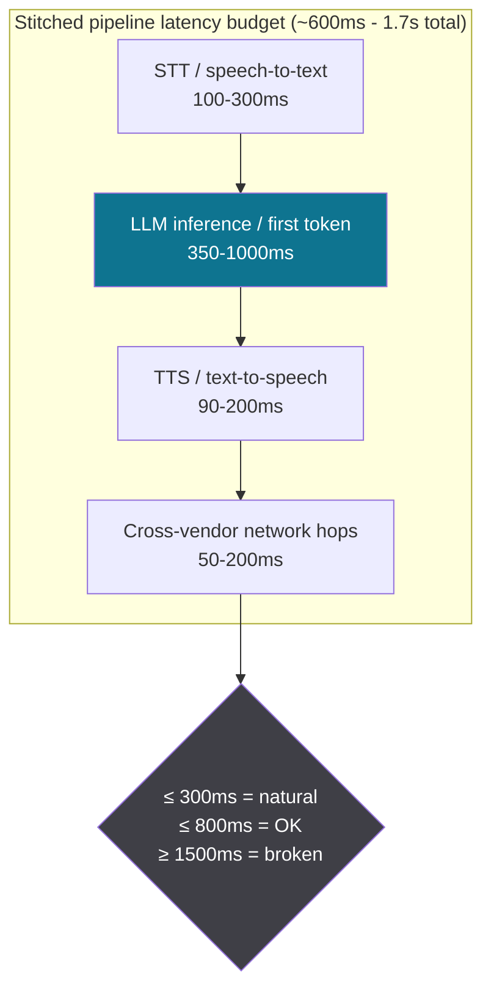
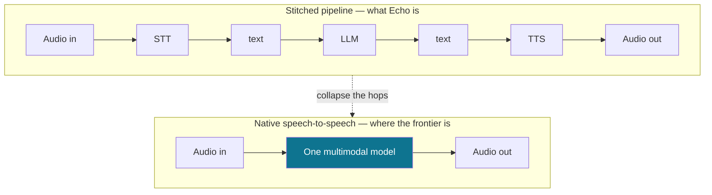
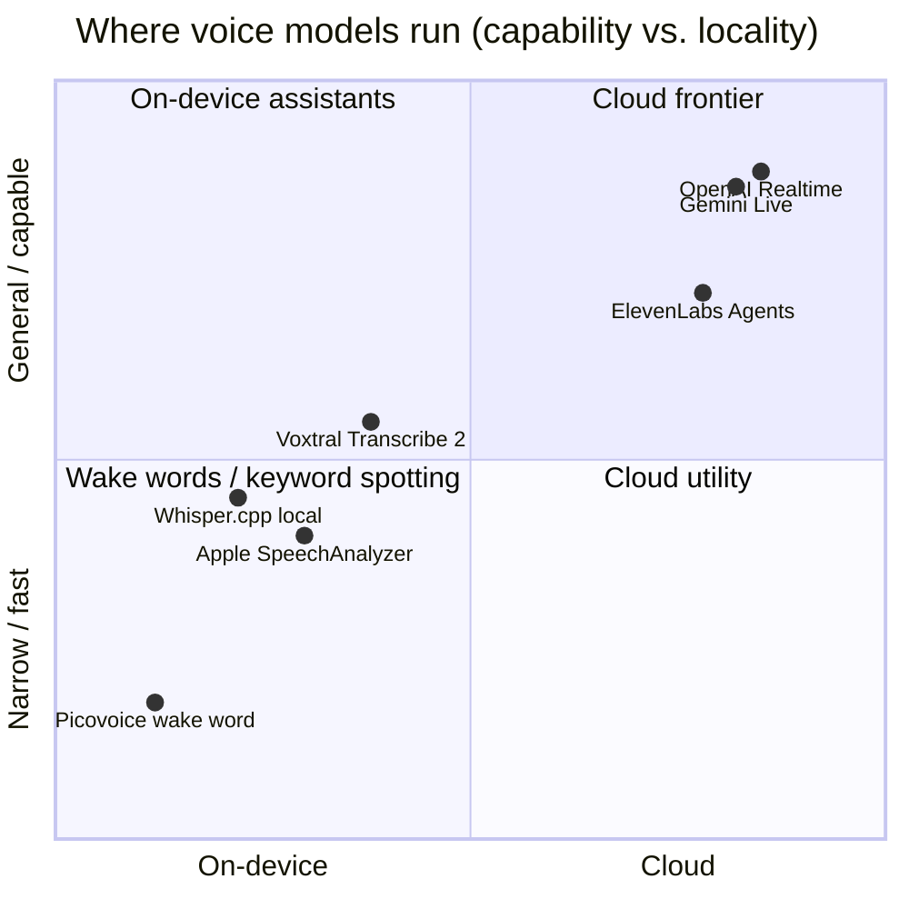

# The state of voice AI: what building Echo taught me, and where talking to machines is going

*The other two posts are close-ups. [The 800ms Problem](./the-800ms-problem.md) is the
latency war-story; [The model was the easy part](./lessons-and-the-near-future-of-voice.md)
is the reflection. This one zooms all the way out: what shipping [Echo](../../README.md)
actually taught me, why realtime voice suddenly matters, and an honest read on where the
market is heading in 2025–2026 — grounded in what the labs and the funding are actually
doing, with sources inline.*

---

## Why I built the pipeline by hand

Echo is a deliberately old-fashioned voice agent. It stitches three separate stages
together: browser speech recognition for the ears, a streaming LLM for the brain
(Gemini `gemini-3.1-flash-lite`), and browser speech synthesis for the mouth. That
"STT → LLM → TTS" chain is exactly the architecture the frontier is now trying to
*delete*. So why build it the slow way?

Because you can't have an opinion about what speech-to-speech models are compressing
until you've felt every millisecond they're removing. Building the pipeline by hand
is the only way I know to understand the thing it replaces.

Here is the whole loop, with the honest cost of each hop:

The naive version waits for the *whole* LLM reply before the first word is spoken —
three or four seconds of dead air per turn. Echo's one real trick is the sentence
chunker: it flushes the first complete sentence to text-to-speech the instant the
model produces it, so Echo starts *talking* on sentence one while sentence three is
still generating. Perceived latency collapses from "length of the answer" to "time
to the first sentence."

That number matters more than it looks. Cross-linguistic research on human
conversation (Stivers et al., analyzing turn-taking across ten languages) found the
gap between one speaker finishing and the next starting averages around **200ms** —
listeners start planning their reply *before* you've finished talking ([PNAS via
Future AGI's turn-taking guide](https://futureagi.com/blog/voice-ai-barge-in-turn-taking-2026/)).
That 200ms isn't a nice-to-have target; it's neurologically baked in. Industry
write-ups converge on the same thresholds: under ~300ms feels natural, **anything
past ~800ms reads as a delay, and past ~1.5s the conversation feels broken**
([SIMBA Voice](https://simbavoice.ai/resources/latency-in-voice-ai-why-sub-500ms-matters),
[Hamming AI](https://hamming.ai/resources/voice-ai-latency-whats-fast-whats-slow-how-to-fix-it)).

## Latency is the product — here's the budget

Every voice agent is really a latency-budget engineering problem wearing an AI
costume. A typical *stitched* pipeline (the kind Echo is) spends its time roughly
like this ([Telnyx's component breakdown](https://telnyx.com/resources/voice-ai-delay-causes)):

Two things jump out of that budget. First, the **LLM is the fattest line item** —
which is why "use a small fast model" (Echo runs Gemini Flash Lite) buys you more
than almost anything else. Second, the *seams between vendors* quietly cost you
50–200ms each; every time audio crosses a process or a network boundary, you pay.
That second observation is the entire thesis behind where the market is going next.

## The market shift: from pipelines to speech-to-speech

The biggest structural change in voice AI over 2025–2026 is the move from
*stitched pipelines* (STT → text → LLM → text → TTS, the thing Echo is) to
**native speech-to-speech models** that ingest audio and emit audio through one
model, deleting the seams entirely.

Collapsing the pipeline does two things a transcribe-then-resynthesize chain
structurally cannot: it **kills the inter-stage latency**, and it **preserves
tone, emotion, and interruption** that get flattened the moment speech becomes a
plain-text transcript. Here's who is actually building it:

- **OpenAI Realtime API.** OpenAI's `gpt-realtime` is a single speech-to-speech
  model (no transcription hop) aimed at production voice agents, with a cheaper
  `gpt-realtime-mini` tuned for "near-instant latency"
  ([OpenAI](https://openai.com/index/introducing-gpt-realtime/)). It is not cheap:
  audio runs roughly **$32 / 1M input tokens and $64 / 1M output tokens**, which
  works out to something like **~$0.50 for a 5-minute call**
  ([Skywork pricing breakdown](https://skywork.ai/blog/agent/openai-realtime-api-pricing-2025-cost-calculator/)).
  Latency-as-a-feature, billed accordingly.
- **Gemini Live API (native audio).** Google's `gemini-2.5-flash` native-audio
  model "processes raw audio natively through a single, low-latency model,"
  shipping 30 HD voices across 24 languages plus live speech-to-speech translation
  ([Google blog](https://blog.google/products/gemini/gemini-audio-model-updates/),
  [Live API docs](https://ai.google.dev/gemini-api/docs/live-api/capabilities)).
  Note the churn: the `native-audio-09-2025` preview is already slated for removal
  in March 2026 in favor of the GA model — this space moves fast enough that model
  IDs rot.
- **ElevenLabs.** The independent voice specialist. Their Conversational AI 2.0 /
  Eleven v3 stack advertises **sub-100ms** model latency and **<500ms end-to-end**
  by owning the full STT + orchestration + TTS stack — exactly the "delete the
  seams" play. The market is betting on it: a **$500M Series D at an $11B
  valuation** in Feb 2026, on ~$330M ARR
  ([ElevenLabs](https://elevenlabs.io/blog/series-d),
  [Biometric Update](https://www.biometricupdate.com/202602/elevenlabs-raises-500m-to-globally-scale-enterprise-voice-ai-agent-adoption)).

And the money confirms the thesis. Voice AI funding **surged roughly eightfold to
~$2.1B in 2025**, and forecasters peg the AI voice-agents market growing from a
few billion in 2024 toward tens of billions by the early 2030s at a ~30%+ CAGR
([Grand View Research](https://www.grandviewresearch.com/industry-analysis/ai-voice-agents-market-report),
[CX Today](https://www.cxtoday.com/contact-center/why-voice-ai-adoption-is-accelerating-in-2026/)).
Treat the precise headline numbers with the usual analyst-report skepticism — they
disagree with each other by billions — but the *direction* and the *funding* are
not ambiguous.

## Cloud vs. on-device: the other axis

Speech-to-speech is the "how good / how low-latency" axis. The quieter, equally
important axis is **where the model runs**. On-device speech AI got dramatically
more practical in 2025–2026:

The on-device story got real, fast. Quantization and distillation mean
"what required a data-center GPU in 2023 can run on a laptop in 2026" — a
large-v3 Whisper distillation compressed from ~3GB to ~400MB with under 2% accuracy
loss, streaming in real time on an iPhone 13+
([Local AI Master](https://localaimaster.com/blog/whisper-local-speech-to-text),
[Forasoft](https://www.forasoft.com/blog/article/speech-recognition-with-neural-networks-on-ios-1621)).
Apple shipped `SpeechAnalyzer` (on-device, no duration cap) at WWDC 2025, and
Apple Intelligence runs on-device by default, escalating to Private Cloud Compute
only when needed
([Basil AI](https://basilai.app/articles/2025-11-07-apple-speech-recognition-vs-openai-whisper-privacy-comparison.html)).
Mistral's Voxtral pushes open-weight transcription toward sub-200ms
([Forasoft](https://www.forasoft.com/blog/article/speech-recognition-with-neural-networks-on-ios-1621)).

The trade-off is the classic one: on-device wins on **privacy, offline, zero
marginal cost, and no network hop**; cloud wins on **raw capability and the
full-duplex speech-to-speech experience**. Echo actually lives on *both* sides of
this line — its STT/TTS are browser-local (your speech never leaves your machine),
while the LLM is the one cloud round-trip. The optional **Picovoice Porcupine**
wake word is the purest on-device case: spotting one keyword in WASM, locally, is
the right tool versus streaming all your audio to a cloud recognizer just to catch
the word "Computer."

## The assistant landscape: command → conversation

Step back from APIs and the consumer story is a shift in *interaction model*. The
last decade of assistants — Siri, Alexa, Google Assistant — were **command**
interfaces: say the magic words, get one action, no memory, no interruption. The
current frontier is **conversation**: interrupt, change your mind, be understood in
context, get cut off and recover gracefully. Barge-in and turn-taking (the stuff I
spent two weeks on in Echo) are the dividing line between those two worlds.

That's why the assistant incumbents are all being rebuilt on LLM cores, and why a
pure-play like ElevenLabs can raise at $11B against them: the moat moved from
"who owns the smart speaker" to "who has the lowest-latency, most natural
conversational stack." The hardware sells the data; the conversation sells the
trust.

## My take as an engineer

A few opinions I'll actually defend, having built the slow version:

**1. The model is a commodity; the milliseconds and the turn-taking are the
product.** I swapped Echo's LLM behind a flag with zero drama. What I could *not*
swap cheaply was the feeling of being able to cut it off and have it shut up
instantly. The differentiation in voice AI is not the IQ of the model — it's the
800 milliseconds and the barge-in. The market pricing latency as the headline
feature (OpenAI's per-minute realtime billing, ElevenLabs' sub-100ms marketing)
confirms it.

**2. Native speech-to-speech wins, but stitched pipelines won't die — they'll get
cheaper to host.** The frontier experience (full-duplex, emotional, interruptible)
needs end-to-end audio models. But a huge amount of *real* voice work —
appointment booking, support triage, IVR replacement — runs fine on a stitched
pipeline with a small fast LLM, and a stitched pipeline is debuggable, swappable,
and cheap. I'd reach for speech-to-speech when the *feel* is the product, and for
a pipeline when the *task* is the product. Most businesses have the second problem.

**3. On-device is underrated and will eat the privacy-sensitive long tail.** The
2026 reality that a real Whisper distillation runs on a phone changes the default.
For anything where the audio is sensitive — health, legal, kids, regulated
industries — "the speech never leaves the device" stops being a constraint and
becomes a selling point. I'd bet the *next* interesting voice products are hybrid:
on-device for capture/wake/privacy, cloud only for the heavy reasoning hop. That's
literally Echo's architecture, and it wasn't an accident.

**4. The honest caveats are the engineering.** Echo's mic hears its own TTS and
there is no clean software fix in the browser (no raw stream, no echo cancellation)
— so I default to hands-free with headphones and *say so*. The same capability
that makes voice "feel human" is the same capability that makes it "always
listening," and the privacy questions get sharper exactly as the experience gets
smoother. The trustworthy move — in a portfolio demo and in a shipped product — is
to name the constraint, not paper over it.

**5. Accessibility is the most underrated impact.** Everyone leads with
contact-center cost savings (Gartner figures the savings in the tens of billions —
[CX Today](https://www.cxtoday.com/contact-center/why-voice-ai-adoption-is-accelerating-in-2026/)).
Fine. But a genuinely conversational interface is a real unlock for people with
vision impairments, limited literacy, or motor constraints — and that's the part
of this wave I'd actually be proud to have worked on.

---

*Echo is open source. The two close-up posts: [The 800ms Problem](./the-800ms-problem.md)
(the latency build-log) and [The model was the easy part](./lessons-and-the-near-future-of-voice.md)
(the reflection). Or read the code: the [turn-taking state machine](../../src/lib/conversation/turnMachine.ts)
and the [sentence chunker](../../src/lib/conversation/sentenceChunker.ts).*

## Sources

- [OpenAI — Introducing gpt-realtime](https://openai.com/index/introducing-gpt-realtime/)
- [Skywork — OpenAI Realtime API pricing 2025](https://skywork.ai/blog/agent/openai-realtime-api-pricing-2025-cost-calculator/)
- [Google — Gemini 2.5 native audio updates](https://blog.google/products/gemini/gemini-audio-model-updates/)
- [Google AI — Gemini Live API capabilities](https://ai.google.dev/gemini-api/docs/live-api/capabilities)
- [ElevenLabs — Series D ($500M, $11B valuation)](https://elevenlabs.io/blog/series-d)
- [Biometric Update — ElevenLabs raises $500M](https://www.biometricupdate.com/202602/elevenlabs-raises-500m-to-globally-scale-enterprise-voice-ai-agent-adoption)
- [Future AGI — voice AI barge-in & turn-taking (2026)](https://futureagi.com/blog/voice-ai-barge-in-turn-taking-2026/)
- [SIMBA Voice — why sub-500ms latency matters](https://simbavoice.ai/resources/latency-in-voice-ai-why-sub-500ms-matters)
- [Hamming AI — voice AI latency breakdown](https://hamming.ai/resources/voice-ai-latency-whats-fast-whats-slow-how-to-fix-it)
- [Telnyx — voice AI delay causes / component latency](https://telnyx.com/resources/voice-ai-delay-causes)
- [Grand View Research — AI voice agents market report](https://www.grandviewresearch.com/industry-analysis/ai-voice-agents-market-report)
- [CX Today — why voice AI adoption is accelerating in 2026](https://www.cxtoday.com/contact-center/why-voice-ai-adoption-is-accelerating-in-2026/)
- [Local AI Master — running Whisper locally in 2026](https://localaimaster.com/blog/whisper-local-speech-to-text)
- [Forasoft — iOS on-device speech recognition in 2026](https://www.forasoft.com/blog/article/speech-recognition-with-neural-networks-on-ios-1621)
- [Basil AI — Apple speech recognition vs. Whisper (privacy)](https://basilai.app/articles/2025-11-07-apple-speech-recognition-vs-openai-whisper-privacy-comparison.html)
